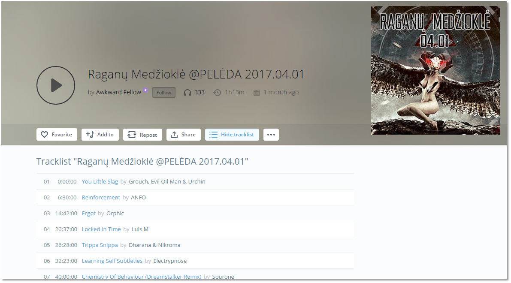

# Mixcloud Tracklist & Downloads browser extension

This is an *unofficial* Mixcloud browser extension. It displays the tracklist
the same way it did before they changed their [licensing][mc-support]. Track list is also
intractive, you can click on track to jump to that track in media player.

Extension was originaly developed by [Andrew Lawson][originalgit]. 

It supports the new Mixcloud website, having come out of beta in January 2017.

# Didn't this used to exist?
Yep, it used to be built into the Mixcloud website, but their licensing changed meaning they couldn't show the tracklist.

> As a non-interactive streaming service, our licenses don't allow for
> tracklists to be made visible in advance. However as you listen through a
> show or DJ mix set, the track names will be revealed.
>
> Last Updated: Jul 28, 2015 05:20PM IST

---

 - [Google Chrome Extension][chrome-install]
 - Other browsers - not tested

---

---

## License
The content of this library is released under the **MIT License** by
**Þygintas Bernotavièius**.  You can find a copy of this license in
[`LICENSE`](LICENSE) or at http://opensource.org/licenses/mit.

[chrome-install]: https://chrome.google.com/webstore/detail/mixcloud-tracklist/lkoingeajallinlnijfpmmddoeoficef
[mc-support]: http://support.mixcloud.com/customer/portal/articles/1595557
[originalgit]: https://github.com/adlawson/mixcloud-tracklist