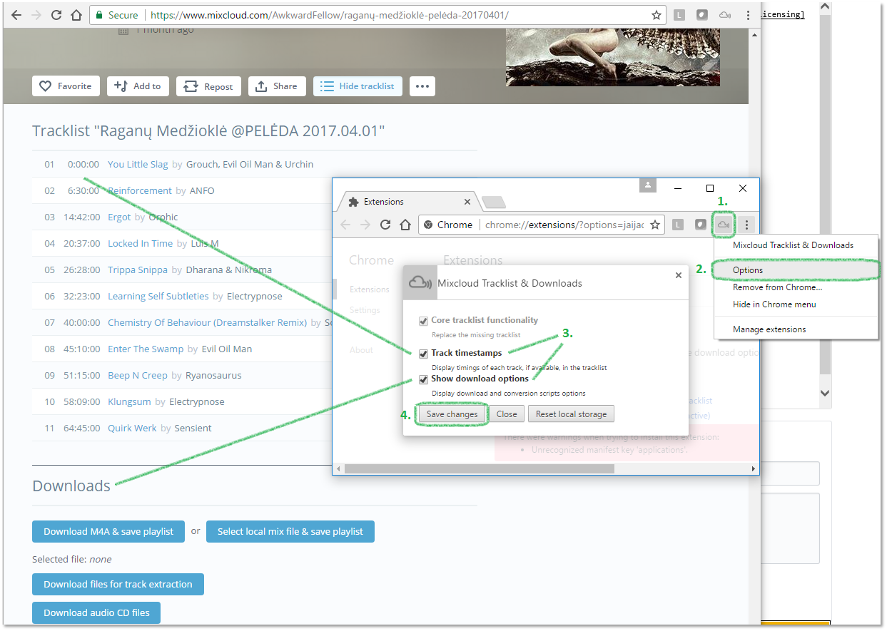
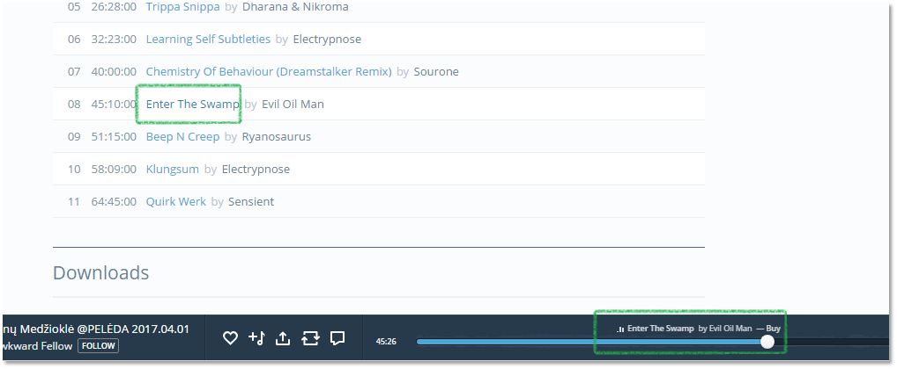
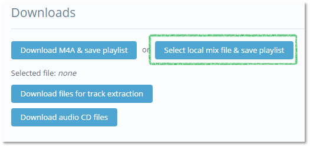
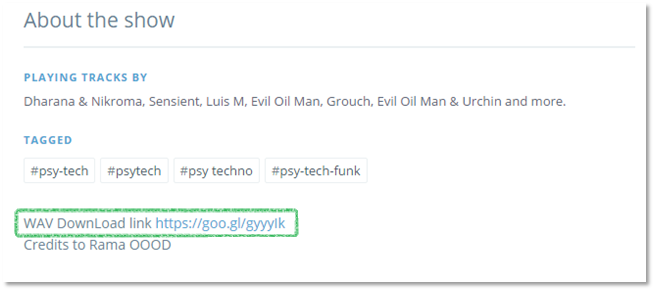
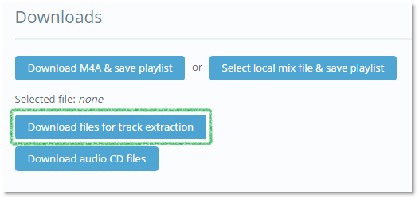
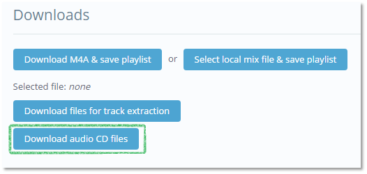

# Mixcloud Tracklist & Downloads browser extension

(updating in progress)

This is an *unofficial* Mixcloud browser extension. It displays the tracklist
the same way it did before they changed their [licensing][mc-support]. 
Extension was originally created by [Andrew Lawson][originalgit]. 

Track list is also intractive, you can click on track to jump to that track in media player.

Extension supports the new Mixcloud website, having come out of beta in January 2017.

---

 - [Google Chrome Extension][chrome-install]
 - Other browsers - not tested

---

---

## Didn't this used to exist?
Yep, it used to be built into the Mixcloud website, but their licensing changed meaning they couldn't show the tracklist.

> As a non-interactive streaming service, our licenses don't allow for
> tracklists to be made visible in advance. However as you listen through a
> show or DJ mix set, the track names will be revealed.
>
> Last Updated: Jul 28, 2015 05:20PM IST

## License
The content of this library is released under the **MIT License** by
**Žygintas Bernotavičius**.  You can find a copy of this license in
[`LICENSE`](LICENSE) or at http://opensource.org/licenses/mit.

# Instructions

## Extension options:

## Play any track

## Download options
### Why downloading a mix?
-
If you just want to listen to a mix, use Mixcloud directly. That's the best option you have when internet is available. However sometimes you don't have internet access, but still want to listen to your favorite mix. This could be in a car which is only equipped with a CD or USB player, during jogging with your MP3 player or while a flight without a broadband connection. For those scenarios you can use these downloads to download your favorite mix and listen to it offline.

### Download mix file with playlist

-
This will download mix in one file (M4A or MP3 if available). M3U playlist will be also generated. Only VLC player supports track skipping for such playlist. For other options read further.

### OR...
### Select local mix file and generate playlist

--
This option is usefull if you have better quality mix file but do not have playlistm, e.g. artist provided original mix file:

--
It will also produce better quality output for options below.

### Download files for track extraction

--

### Download audio CD files

--

[chrome-install]: https://chrome.google.com/webstore/detail/mixcloud-tracklist-downlo/lglkomjmpemepahcicfhkpbcmfncpefi
[mc-support]: http://support.mixcloud.com/customer/portal/articles/1595557
[originalgit]: https://github.com/adlawson/mixcloud-tracklist
